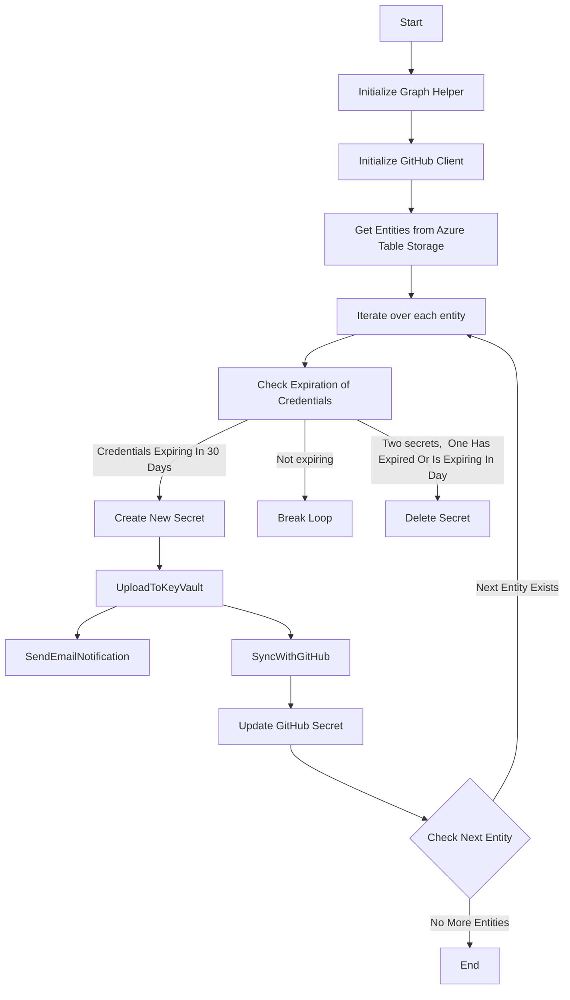

# Azure Secret Rotation Application Documentation

The Azure Secret Rotation application provides an automated solution for managing and rotating secrets associated with Azure App Registrations. The application interfaces with various services such as Microsoft Graph API, Azure Key Vault, Azure Table Storage, and integrates with GitHub for updating repository secrets.

## Optional Functionality

If you are managing authentication from Github to Azure through federated credentials, you don't have to add Github private key to your container. 
azuresecretrotator.private-key.pem, see github.go for more details.

## Overview of Services

- **Microsoft Graph API**: Used for retrieving and updating App Registration details.
- **Azure Key Vault**: Manages secrets in the Azure Key Vault.
- **Azure Table Storage**: Stores and retrieves Azure entities information.
- **GitHub**: Updates repository secrets on GitHub.

## Table of Contents

1. [Main Package](#main-package)
2. [Helpers Package](#helpers-package)
3. [APIs Package](#apis-package)

---

## Main Package

The main package of the application is responsible for orchestrating the secret rotation process, including initializing helpers and clients, retrieving App Registration information, and handling the flow of the rotation mechanism.

### Main Function Workflow

1. Reads environment variables for local use, primarily for development and testing.
2. Initializes GraphHelper for interacting with the Microsoft Graph API.
3. Initializes the GitHub Client for managing secrets in GitHub repositories.
4. Retrieves a list of entities from Azure Table Storage.
5. Iterates over each entity to manage App Registration secrets, updates Azure Key Vault, and syncs with GitHub if necessary.
6. Prompts the user for actions and responds with appropriate secret management operations.

---

## Helpers Package

This package contains utility functions related to secret management tasks, including functions to interact with Azure Key Vault, Microsoft Graph API, and Azure Table Storage.

### Key Components and Functions

- **GraphHelper**: Struct and associated methods for managing secrets within Microsoft Graph API.
- **Entity**: Struct representing an entity in the system with attributes like App Registration Name and Object ID.
- **InitializeGraphForAppAuth**: Initializes Microsoft Graph client with the appropriate authorization credentials.
- **CreateNewSecret**: Creates a new secret for an App Registration.
- **DeleteSecret**: Deletes a secret from an App Registration.
- **UploadToKeyVault**: Uploads secrets to Azure Key Vault.
- **SetKeyVaultSecret**: Internal function for updating secrets in Azure Key Vault.
- **GetCredentialExpiration**: Checks expiration of credentials and creates new ones if necessary.
- **GetExpirationAndDelete**: Deletes expired credentials from App Registrations.
- **GetApplicationId**: Retrieves the Application ID of an App Registration.
- **StorageAccountConnection**: Connects to Azure Table Storage and retrieves all entities.

---

## APIs Package

The `apis` package establishes how the application interacts with the GitHub API and encrypts secret data for use in GitHub Actions Secrets.

### Key Functions

- **GithubClient**: Initializes and configures a new GitHub API client.
- **EncodeWithPublicKey**: Encrypts a payload using a provided GitHub repository's public key.
- **CreateOrUpdateGithubSecret**: Creates or updates a secret within a GitHub repository after encrypting the value with the repository's public key.
- **AzureAuthCreds**: A struct that stores necessary Azure credentials.

# Azure Secret Rotation Process Flow

### Additional Considerations

When deploying the Azure Secret Rotation application in a production environment, make sure to carefully manage permissions and employ best practices for security. Utilize Azure Managed Identities where possible to avoid managing credentials in code or configuration files. Additionally, implement comprehensive logging and error handling to monitor the application's behavior and identify points of failure.

Please refer to the source code directly for a detailed explanation of the implementation and usage of each function and struct.

## License

This project is licensed under the GNU General Public License v3.0 - see the [LICENSE](LICENSE) file for details.
